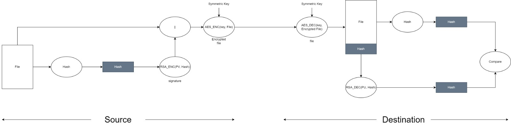

# Computer and Network Security Project
- Use openssl library to develop security tool.
- Allow user to define encryption methods and keys.
- Encrypt/Decrypt using shared key.
- Sign/Verify files using private/public certificates.
- Encrypt + Sign/Decrypt + Verify files using private/public certificates.
- Use Python, C/C++, C#, Java, JavaScript.
- Make software application for desktop, web or mobile.


--- 

# Commands


## AES Encryption Providing Key

```
python .\App.py -enc <file_name> -key <key_file_name>
```

* Can encrypt/decrypt any binary file.

## AES Encryption Using a Generated Key

```
python .\App.py -enc <file_name> -gen
```

* *Note:* key is written to a file security is your responsibility.

## AES Decryption

```
python .\App.py -dec <file_name> -key <key_file_name>
```

## RSA Key Generation

```
python .\App.py -rsa -gen  
```

## RSA Encryption Providing Key

```
python .\App.py -rsa -enc -inkey <public_key_file_name> <file_name>
```
## RSA Encryption Generated Key

```
python .\App.py -rsa -enc -gen <file_name>
```

* *Note:* key is written to a file security is your responsibility.

## RSA Decryption Providing Key

```
python .\App.py -rsa -dec -inkey <private_key_file_name> <message_encrypted_file_name>  
```

## RSA Signature

```
python .\App.py -rsa -sign -gen <file_name>  
```

## RSA Verification

```
python .\App.py -rsa -verify -inkey <public_key_file_name> <file_name> <signed_message_file_name> 
```

## Hashing

```
python App.py -hash <algorithm_type> <file_name>
```
* **Valid algorithms :**
    * `md5`
    * `sha1`
    * `sha224`
    * `sha256`
    * `sha384`
    * `sha512`
    * `blake2b`
    * `blake2s`
    * `sha3_224`
    * `sha3_256`
    * `sha3_384`
    * `sha3_512`
    * `shake_128`
    * `shake_256`

# Confidentiality + Authentication

<p align="center">
  
</p>

## Prepare Confidentiality + Authentication

```
python App.py -sign <file_name>  
```

## Verify Confidentiality + Authentication

```
python App.py -verify <Message_Encrypted_File_Name>  <symmetric_key_file_name> <public_key_file_name>  
```


## Self_Certification

```
python App.py -certify <subject_name> <issuer_name>   
```